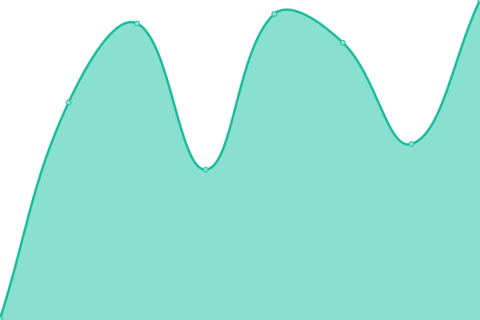
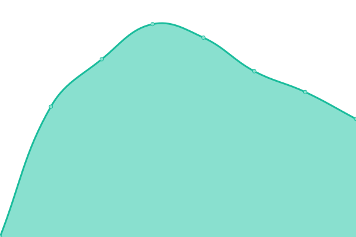
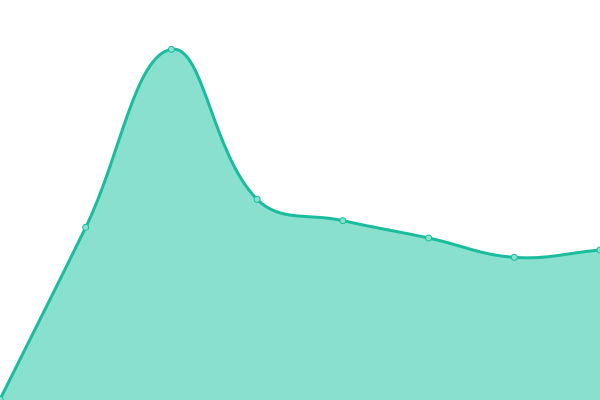

# [📈 Live Status](https://demo.upptime.js.org): <!--live status--> **🟩 All systems operational**

This repository contains the open-source uptime monitor and status page for [Rexmas SPA](https://demo.upptime.js.org), powered by [Upptime](https://github.com/upptime/upptime).

With [Upptime](https://upptime.js.org), you can get your own unlimited and free uptime monitor and status page, powered entirely by a GitHub repository. We use [Issues](https://github.com/Rexmas SPA/rexmas-uptime/issues) as incident reports, [Actions](https://github.com/Rexmas SPA/rexmas-uptime/actions) as uptime monitors, and [Pages](https://demo.upptime.js.org) for the status page.

<!--start: status pages-->
<!-- This summary is generated by Upptime (https://github.com/upptime/upptime) -->
<!-- Do not edit this manually, your changes will be overwritten -->
<!-- prettier-ignore -->
| URL | Status | History | Response Time | Uptime |
| --- | ------ | ------- | ------------- | ------ |
|  [Rexmas Chile](https://tercera.rexmas.cl/remuneraciones/es-CL/login) | 🟩 Up | [rexmas-chile.yml](https://github.com/yorkijr/rexmas-uptime/commits/HEAD/history/rexmas-chile.yml) | 

 247ms
     
 | 

<a href="https://demo.upptime.js.org/history/rexmas-chile">100.00%</a>
    

|  [Rexmas SSO](https://accounts.rexmas.com/login?membership_id=&system_id=&session_token=) | 🟩 Up | [rexmas-sso.yml](https://github.com/yorkijr/rexmas-uptime/commits/HEAD/history/rexmas-sso.yml) | 

 110ms
     
 | 

<a href="https://demo.upptime.js.org/history/rexmas-sso">100.00%</a>
    

|  [Ayuda Rexmas](https://ayuda.rexmas.com/ayudas) | 🟩 Up | [ayuda-rexmas.yml](https://github.com/yorkijr/rexmas-uptime/commits/HEAD/history/ayuda-rexmas.yml) | 

 209ms
     
 | 

<a href="https://demo.upptime.js.org/history/ayuda-rexmas">100.00%</a>
    

|  [Sitio Web Rexmas](https://rexmas.com) | 🟩 Up | [sitio-web-rexmas.yml](https://github.com/yorkijr/rexmas-uptime/commits/HEAD/history/sitio-web-rexmas.yml) | 

 133ms
     
 | 

<a href="https://demo.upptime.js.org/history/sitio-web-rexmas">100.00%</a>
    

<!--end: status pages-->

[**Visit our status website →**](https://demo.upptime.js.org)

## 📄 License

- Powered by: [Upptime](https://github.com/upptime/upptime)
- Code: [MIT](./LICENSE) © [Rexmas SPA](https://demo.upptime.js.org)
- Data in the `./history` directory: [Open Database License](https://opendatacommons.org/licenses/odbl/1-0/)
